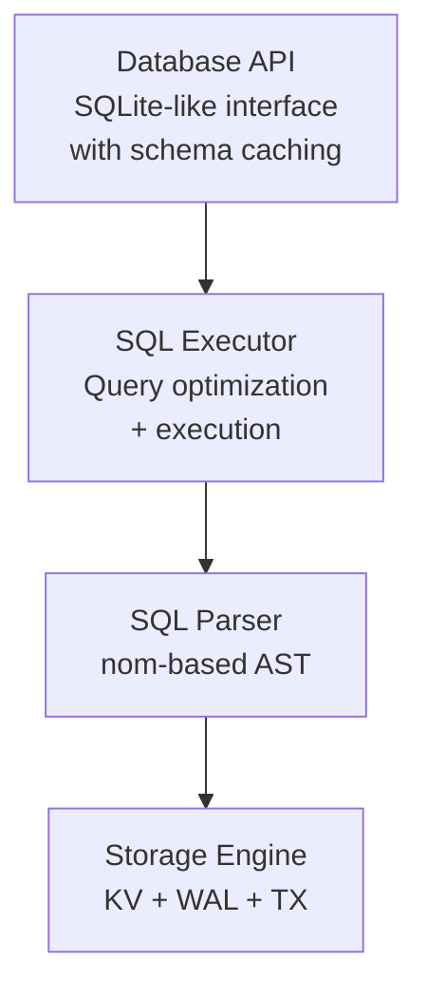

# TegDB

TegDB is a lightweight, embedded database engine with a SQL-like interface designed for simplicity, performance, and reliability. It provides ACID transactions, crash recovery, and efficient RDBMS.

> **Design Philosophy**: TegDB prioritizes simplicity and reliability over complexity. It uses a single-threaded design to eliminate concurrency bugs, reduce memory overhead, and provide predictable performance - making it ideal for embedded systems and applications where resource efficiency matters more than parallel processing.

## Key Features

### 🚀 **Performance & Footprint**

- Key->offset B+tree index; values are stored on disk, small values can be inlined to reduce IO
- Bounded cache (configurable cap) to boost hot-read hit rates
- Primary key optimized queries (O(log n) lookups)
- Streaming query processing with early LIMIT termination
- Efficient binary serialization

### 🔒 **ACID Transactions**

- Atomicity: All-or-nothing transaction execution
- Consistency: Schema validation and constraint enforcement  
- Isolation: Write-through with snapshot-like behavior
- Durability: Write-ahead logging with commit markers

### 🛡️ **Reliability**

- Crash recovery from write-ahead log
- File locking prevents concurrent access corruption
- Graceful handling of partial writes and corruption
- Automatic rollback on transaction drop
- Strong durability by default: per-transaction fsync, configurable group commit
- Observability: metrics for bytes read/written, cache hits/misses, fsync counts

### 📦 **Simple Design**

- Single-threaded architecture eliminates race conditions
- Minimal dependencies (only `fs2` for file locking)
- Clean separation of concerns across layers
- Extensive test coverage including ACID compliance

### 🔌 **Extension System**

- PostgreSQL-inspired plugin architecture
- Built-in string functions: UPPER, LOWER, LENGTH, TRIM, SUBSTR, REPLACE, CONCAT, REVERSE
- Built-in math functions: ABS, CEIL, FLOOR, ROUND, SQRT, POW, MOD, SIGN
- Create custom scalar and aggregate functions
- Type-safe function signatures with validation

## Getting Started

### Quick Start (CLI + MinIO in 2–3 minutes)

This walkthrough uses released builds and the CLI tools, no code required.

1) Install the CLIs

```bash
# Clone the repository
cd tegdb

# Build both CLI tools (tg and tgstream)
cargo build --release

# Or build individually:
# cargo build --release --bin tg
# cargo build --release --bin tgstream

# Copy binaries to PATH (or add target/release to your PATH)
cp target/release/tg ~/.cargo/bin/
cp target/release/tgstream ~/.cargo/bin/

# Ensure ~/.cargo/bin is on your PATH
export PATH="$HOME/.cargo/bin:$PATH"
```

**Alternative**: If you prefer installing from crates.io:

```bash
cargo install tegdb --version 0.3.0 --bin tg
cargo install tegdb --version 0.3.0 --bin tgstream
```

2) Start MinIO locally and create a bucket

```bash
# Run MinIO
  -e MINIO_ROOT_USER=minioadmin -e MINIO_ROOT_PASSWORD=minioadmin \
  quay.io/minio/minio server /data --console-address :9001

# Create a bucket using the MinIO Console at http://localhost:9001 (Login: minioadmin/minioadmin)
# In the Console: Buckets → Create Bucket → Name: tegdb-backups
```

3) Configure AWS-compatible env vars for MinIO

```bash
export AWS_ACCESS_KEY_ID=minioadmin
export AWS_SECRET_ACCESS_KEY=minioadmin
export AWS_REGION=us-east-1
export AWS_ENDPOINT_URL=http://127.0.0.1:9000
export TGSTREAM_BUCKET=tegdb-backups
```

4) Create and query a database with the `tg` CLI

```bash
# Use an absolute file URL ending with .teg
DB=file:///$(pwd)/quickstart.teg

# Create table and insert a row
tg "$DB" --command "INSERT INTO users (id, name) VALUES (1, 'Alice');"

# Query
```

5) Enable continuous cloud backup to MinIO with `tgstream`

```bash
# Create config file (use absolute path - replace /path/to with your actual path)
cat > tgstream.toml <<EOF
database_path = "$(pwd)/quickstart.teg"

[s3]
bucket = "tegdb-backups"
prefix = "dbs/quickstart"
region = "us-east-1"
endpoint = "http://127.0.0.1:9000"
access_key_id = "minioadmin"
secret_access_key = "minioadmin"

[base]
interval_minutes = 1
segment_size_mb = 50

[segment]
min_bytes = 1024
debounce_ms = 1500

[retention]
bases = 3
max_segments_bytes = 107374182400

gzip = true
EOF

# Start replication (best run under a supervisor/tmux)
tgstream run --config tgstream.toml

# In another terminal, verify backup is working:
tgstream list --config tgstream.toml
# You should see base snapshots appearing every 15 minutes
```

6) Restore database from backup

```bash
# List available backups

# Restore to latest state

# Verify restored data
# Should show: Alice
```

**Example restore scenario**: If your original database gets corrupted or deleted, you can restore it from MinIO:

```bash
# Original database is lost/corrupted
rm quickstart.teg

# Restore from backup

# Continue using the restored database
```

## Using TegDB as a Library

Add TegDB to your `Cargo.toml`:

```toml
[dependencies]
tegdb = "0.3.0"
```

### Basic Usage

```rust
use tegdb::Database;

fn main() -> tegdb::Result<()> {
    // Open or create a database (must use absolute file:// path ending in .teg)
    let mut db = Database::open("file:///tmp/my_app.teg")?;
    
    // Create a table
    db.execute("CREATE TABLE users (id INTEGER PRIMARY KEY, name TEXT(32), age INTEGER)")?;
    
    // Insert data
    db.execute("INSERT INTO users (id, name, age) VALUES (1, 'Alice', 30)")?;
    db.execute("INSERT INTO users (id, name, age) VALUES (2, 'Bob', 25)")?;
    
    // Query data
    let result = db.query("SELECT name, age FROM users WHERE age > 25")?;
    
    println!("Found {} users:", result.len());
    for row in result.rows() {
        if let (Some(name), Some(age)) = (row.first(), row.get(1)) {
            println!("User: {:?}, Age: {:?}", name, age);
        }
    }
    
    Ok(())
}
```

### Transaction Example

```rust
use tegdb::Database;

fn main() -> tegdb::Result<()> {
    let mut db = Database::open("file:///tmp/bank.teg")?;
    
    // Create accounts table
    db.execute("CREATE TABLE accounts (id INTEGER PRIMARY KEY, name TEXT(32), balance INTEGER)")?;
    db.execute("INSERT INTO accounts (id, name, balance) VALUES (1, 'Alice', 1000)")?;
    db.execute("INSERT INTO accounts (id, name, balance) VALUES (2, 'Bob', 500)")?;
    
    // Transfer funds using explicit transaction
    let mut tx = db.begin_transaction()?;
    
    // Debit from Alice's account
    tx.execute("UPDATE accounts SET balance = balance - 100 WHERE id = 1")?;
    
    // Credit to Bob's account  
    tx.execute("UPDATE accounts SET balance = balance + 100 WHERE id = 2")?;
    
    // Commit the transaction (or it will auto-rollback on drop)
    tx.commit()?;
    
    println!("Transfer completed successfully!");
    Ok(())
}
```

## SQL Support

TegDB supports a comprehensive subset of SQL:

### Data Definition Language (DDL)

```sql
-- Create tables with constraints
CREATE TABLE products (
    id INTEGER PRIMARY KEY,
    name TEXT NOT NULL,
    price REAL,
    category TEXT
);

-- Drop tables
DROP TABLE IF EXISTS old_table;
```

### Data Manipulation Language (DML)

```sql
-- Insert single or multiple rows
INSERT INTO products (id, name, price) VALUES (1, 'Widget', 19.99);
INSERT INTO products (id, name, price) VALUES 
    (2, 'Gadget', 29.99),
    (3, 'Tool', 39.99);

-- Update with conditions
UPDATE products SET price = 24.99 WHERE name = 'Widget';

-- Delete with conditions
DELETE FROM products WHERE price < 20.00;

-- Query with filtering and limits
SELECT name, price FROM products 
WHERE category = 'Electronics' 
LIMIT 10;
```

### Transaction Control

```sql
BEGIN;
UPDATE accounts SET balance = balance - 100 WHERE id = 1;
UPDATE accounts SET balance = balance + 100 WHERE id = 2;
COMMIT;
-- or ROLLBACK;
```

### Supported Data Types

- `INTEGER` - 64-bit signed integers
- `REAL` - 64-bit floating point numbers  
- `TEXT` - UTF-8 strings (requires length specification, e.g., TEXT(100))
- `NULL` - Null values

## Extension System

TegDB provides a PostgreSQL-inspired extension system for adding custom functions. Extensions can be loaded via SQL commands (PostgreSQL-style) or programmatically via the Rust API.

### Loading Extensions via SQL (PostgreSQL-style)

The recommended way to manage extensions is using SQL commands:

```sql
-- Load built-in extensions
CREATE EXTENSION tegdb_string;
CREATE EXTENSION tegdb_math;

-- Use extension functions in SQL
SELECT UPPER('hello'), SQRT(144);

-- Load custom extension from dynamic library
CREATE EXTENSION my_extension;
-- Or specify explicit path
CREATE EXTENSION my_extension WITH PATH '/path/to/libmy_extension.so';

-- Extensions persist automatically - they'll be loaded on next database open
-- Remove an extension
DROP EXTENSION my_extension;
```

### Loading Extensions via Rust API

You can also register extensions programmatically:

```rust
use tegdb::{Database, StringFunctionsExtension, MathFunctionsExtension, SqlValue};

let mut db = Database::open("file:///tmp/test.teg")?;

// Register built-in extensions
db.register_extension(Box::new(MathFunctionsExtension))?;

// Call functions directly
let result = db.call_function("UPPER", &[SqlValue::Text("hello".to_string())])?;
assert_eq!(result, SqlValue::Text("HELLO".to_string()));

let result = db.call_function("SQRT", &[SqlValue::Integer(144)])?;
assert_eq!(result, SqlValue::Real(12.0));
```

### Available Functions

**String Functions** (tegdb_string):

- `UPPER(text)` - Convert to uppercase
- `LOWER(text)` - Convert to lowercase
- `LENGTH(text)` - String length
- `TRIM(text)` / `LTRIM(text)` / `RTRIM(text)` - Trim whitespace
- `SUBSTR(text, start, length)` - Extract substring
- `REPLACE(text, from, to)` - Replace occurrences
- `CONCAT(text, ...)` - Concatenate strings (variadic)
- `REVERSE(text)` - Reverse string

**Math Functions** (tegdb_math):

- `ABS(number)` - Absolute value
- `CEIL(number)` / `FLOOR(number)` - Ceiling/floor
- `ROUND(number, decimals)` - Round to decimal places
- `SQRT(number)` - Square root
- `POW(base, exponent)` - Power
- `MOD(a, b)` - Modulo
- `SIGN(number)` - Sign (-1, 0, or 1)

### Creating Custom Extensions

Define custom extensions by implementing the `Extension` trait:

```rust
use tegdb::{Extension, ScalarFunction, FunctionSignature, ArgType, DataType, SqlValue};

// Define a custom function
struct DoubleFunction;

impl ScalarFunction for DoubleFunction {
    fn name(&self) -> &'static str { "DOUBLE" }
    
    fn signature(&self) -> FunctionSignature {
        FunctionSignature::new(vec![ArgType::Numeric], DataType::Real)
    }
    
    fn execute(&self, args: &[SqlValue]) -> Result<SqlValue, String> {
        match &args[0] {
            SqlValue::Integer(i) => Ok(SqlValue::Integer(i * 2)),
            SqlValue::Real(r) => Ok(SqlValue::Real(r * 2.0)),
            _ => Err("Expected numeric argument".to_string()),
        }
    }
}

// Define an extension
struct MyExtension;

impl Extension for MyExtension {
    fn name(&self) -> &'static str { "my_extension" }
    fn version(&self) -> &'static str { "1.0.0" }
    fn scalar_functions(&self) -> Vec<Box<dyn ScalarFunction>> {
        vec![Box::new(DoubleFunction)]
    }
}

// Register and use
let result = db.call_function("DOUBLE", &[SqlValue::Integer(21)])?;
assert_eq!(result, SqlValue::Integer(42));
```

### Extension Management

**Via SQL:**

```sql
-- Extensions are automatically persisted and loaded on database open
-- No need to re-run CREATE EXTENSION after restarting
```

**Via Rust API:**

```rust
// List registered extensions
for (name, version) in db.list_extensions() {
    println!("{} v{}", name, version);
}

// Check if a function exists
if db.has_function("UPPER") {
    println!("UPPER function is available");
}

// Unregister an extension
```

### Creating Loadable Extensions

To create a dynamic library extension that can be loaded via `CREATE EXTENSION`:

1. **Create a Rust library project:**

   ```bash
   cargo new --lib my_extension
   cd my_extension
   ```

2. **Configure Cargo.toml:**

   ```toml
   [lib]
   crate-type = ["cdylib"]
   
   [dependencies]
   tegdb = { path = "../tegdb" }  # Or from crates.io
   ```

3. **Implement the extension:**

   ```rust
   use tegdb::{Extension, ExtensionWrapper, ScalarFunction, SqlValue, FunctionSignature, ArgType, DataType};
   
   struct MyFunction;
   
   impl ScalarFunction for MyFunction {
       fn name(&self) -> &'static str { "MY_FUNCTION" }
       fn signature(&self) -> FunctionSignature {
           FunctionSignature::new(vec![ArgType::TextLike], DataType::Text(None))
       }
       fn execute(&self, args: &[SqlValue]) -> Result<SqlValue, String> {
           match &args[0] {
               SqlValue::Text(s) => Ok(SqlValue::Text(s.to_uppercase())),
               _ => Err("Expected text argument".to_string()),
           }
       }
   }
   
   struct MyExtension;
   
   impl Extension for MyExtension {
       fn name(&self) -> &'static str { "my_extension" }
       fn version(&self) -> &'static str { "1.0.0" }
       fn scalar_functions(&self) -> Vec<Box<dyn ScalarFunction>> {
           vec![Box::new(MyFunction)]
       }
   }
   
   #[no_mangle]
   pub extern "C" fn create_extension() -> *mut ExtensionWrapper {
       Box::into_raw(Box::new(ExtensionWrapper {
           extension: Box::new(MyExtension),
       }))
   }
   ```

4. **Build and install:**

   ```bash
   cargo build --release
   cp target/release/libmy_extension.so ~/.tegdb/extensions/
   # Or place in ./extensions/ relative to your database
   ```

5. **Use in SQL:**

   ```sql
   CREATE EXTENSION my_extension;
   SELECT MY_FUNCTION('hello');
   ```

For complete examples, see `examples/extension_demo.rs` and `examples/extension_template.rs`.

## Performance Characteristics

### Time Complexity

- **Primary key lookups**: O(log n)
- **Range scans**: O(log n + k) where k = result size
- **Inserts/Updates/Deletes**: O(log n)
- **Schema operations**: O(1) with caching

### Memory Usage

- **In-memory index**: BTreeMap holds key -> value offset (values on disk), small values can inline
- **Bounded cache**: Byte-capped value/page cache for hot data
- **Lazy allocation**: Undo logs only allocated when needed
- **Streaming queries**: LIMIT processed without loading full result

### Storage Format

- **Fixed header**: 64-byte header with magic `TEGDB\0`, version (1), limits, flags
- **Append-only log**: Fast writes after the header, no seek overhead
- **Binary serialization**: Compact data representation
- **Key->offset layout**: B+tree holds offsets; values stored in the data region, small values inline
- **Automatic compaction**: Reclaims space from old entries while preserving header
- **Crash recovery**: Replay from last commit marker

## Cloud Backup & Replication (tgstream)

TegDB includes `tgstream`, a standalone streaming backup tool that continuously replicates your database to cloud storage (S3, MinIO, etc.), similar to Litestream for SQLite.

### Features

- **Incremental Replication**: Tracks file offsets and uploads only committed changes
- **Base Snapshots**: Periodic full database snapshots for fast recovery
- **Automatic Rotation Detection**: Handles database compaction/rotation automatically
- **Point-in-Time Recovery**: Restore to any previous state using base + segments
- **Retention Policies**: Configurable retention for snapshots and segments
- **Compression**: Optional gzip compression to reduce storage costs

### Installation

Install from crates.io:

```bash
cargo install tegdb --version 0.3.0 --bin tgstream
# Or install both binaries:
cargo install tegdb --version 0.3.0 --bin tg --bin tgstream
```

### Configuration

Create a configuration file `tgstream.toml`:

```toml
database_path = "/absolute/path/to/your/database.teg"

[s3]
bucket = "my-backup-bucket"
prefix = "dbs/mydb"
region = "us-east-1"
# Optional: For MinIO or custom S3-compatible storage
endpoint = "http://localhost:9000"  # MinIO endpoint
access_key_id = "minioadmin"        # MinIO access key
secret_access_key = "minioadmin"     # MinIO secret key

[base]
interval_minutes = 60  # Create new base snapshot every hour
segment_size_mb = 100   # Or after 100MB of segments

[segment]
min_bytes = 1024        # Minimum segment size to upload
debounce_ms = 2000      # Wait 2 seconds before uploading

[retention]
bases = 3               # Keep last 3 base snapshots
max_segments_bytes = 107374182400  # 100GB max segments

gzip = true             # Enable compression
```

For AWS S3, you can omit `endpoint`, `access_key_id`, and `secret_access_key` and use environment variables or IAM roles instead:

```bash
export AWS_ACCESS_KEY_ID=your-key
export AWS_SECRET_ACCESS_KEY=your-secret
export AWS_REGION=us-east-1
```

### Commands

```bash
# Run continuous replication

# Create a one-off snapshot

# Restore database from backup

# List available snapshots

# Prune old snapshots
```

### How It Works

1. **Monitoring**: Tegstream monitors your `.teg` file for new committed transactions
2. **Segment Uploads**: After each commit, new data is uploaded as incremental segments
3. **Base Snapshots**: Periodically (every N minutes or after N MB of segments), a full snapshot is created
4. **State Tracking**: Local state file tracks progress, file metadata, and prevents duplicate uploads
5. **Restore**: Downloads base snapshot + all subsequent segments to reconstruct the database

The tool is designed to be run as a background service alongside your application, providing continuous off-site backup with minimal overhead.


## Architecture Overview

TegDB implements a clean layered architecture with four distinct layers:



### Core Components

- **Storage Engine**: BTreeMap-based in-memory storage with append-only log persistence
- **Transaction System**: Write-through transactions with undo logging and commit markers
- **SQL Support**: Full SQL parser and executor supporting DDL and DML operations
- **Index-Organized Tables**: Primary key optimization with direct key lookups
- **Schema Caching**: Database-level schema caching for improved performance
- **Crash Recovery**: WAL-based recovery using transaction commit markers

See [ARCHITECTURE.md](ARCHITECTURE.md) for detailed information about:

- Layer-by-layer implementation details
- Storage format and recovery mechanisms  
- Memory management and performance optimizations
- Transaction system and ACID guarantees
- Query optimization and execution strategies

## Advanced Usage

### Engine Configuration

```rust
use std::time::Duration;
use tegdb::storage_engine::{DurabilityConfig, DurabilityLevel, EngineConfig};

let config = EngineConfig {
    max_key_size: 1024,        // 1KB max key size
    max_value_size: 256 * 1024, // 256KB max value size
    auto_compact: true,         // Auto-compact on open
    initial_capacity: None,     // No default key cap; set Some(...) to enforce a hard key cap
    preallocate_size: None,     // No default disk preallocation; set Some(bytes) to cap/preallocate
    // Durability: default is Immediate (fsync every commit)
    durability: DurabilityConfig {
        level: DurabilityLevel::Immediate,
        group_commit_interval: Duration::from_millis(0), // Set >0 to enable group commit
    },
    // Inline hot/small values to avoid disk reads; the rest spill to data pages.
    inline_value_threshold: 64,          // bytes
    cache_size_bytes: 8 * 1024 * 1024,   // value/page cache cap
    // Compaction: absolute threshold + ratio + min delta bytes since last compact
    compaction_absolute_threshold_bytes: 10 * 1024 * 1024,
    compaction_ratio: 2.0,
    compaction_min_delta_bytes: 2 * 1024 * 1024,
    ..Default::default()
};

// Note: Custom config requires low-level API
```

Key defaults:

- Values are stored on disk; the B+tree indexes key -> value offset. Small values (<= `inline_value_threshold`) stay inline.
- A byte-capped value cache (`cache_size_bytes`) keeps hot values in memory.
- Durability defaults to per-commit `fsync`; set `DurabilityLevel::GroupCommit` with a non-zero `group_commit_interval` to coalesce flushes.
- Default compaction uses an absolute threshold (10 MiB), fragmentation ratio (2.0), and a minimum written delta (2 MiB) since the last compaction.
- No default hard cap on key count or disk size; set `initial_capacity` and `preallocate_size` to enforce limits in production.

Metrics (observability):

```rust
let metrics = engine.metrics();
println!(
    "bytes_read={}, bytes_written={}, cache_hits={}, cache_misses={}, fsyncs={}",
    metrics.bytes_read,
    metrics.bytes_written,
    metrics.cache_hits,
    metrics.cache_misses,
    metrics.fsync_count
);
```

### Low-Level Engine API

For advanced use cases, you can access low-level APIs via module paths:

```rust
use tegdb::storage_engine::{StorageEngine, EngineConfig};

// Direct key-value operations (requires absolute PathBuf)
let mut engine = StorageEngine::new(std::path::PathBuf::from("/tmp/data.teg"))?;
engine.set(b"key", b"value".to_vec())?;
let value = engine.get(b"key");

// Transaction control
let mut tx = engine.begin_transaction();
tx.set(b"key1", b"value1".to_vec())?;
tx.set(b"key2", b"value2".to_vec())?;
tx.commit()?;
```

## Development

### Building from Source

```bash
# Standard build
cargo build

# Run tests
cargo test

# Run benchmarks  
cargo bench
```

### Testing

TegDB includes comprehensive tests covering:

- ACID transaction properties
- Crash recovery scenarios  
- SQL parsing and execution
- Performance benchmarks
- Edge cases and error conditions

```bash
# Run the full native test suite
./run_all_tests.sh

# Run with verbose output
./run_all_tests.sh --verbose

# CI-friendly run (preserves test output)
./run_all_tests.sh --ci
```

### RPC Log Server (tglogd)

Run a log server that exposes the WAL over Cap'n Proto RPC and connect with the
`rpc://` protocol using the low-level engine API.

```bash
# Build with RPC support
cargo build --features rpc --bin tglogd

# Start the log server (absolute path recommended)
./target/debug/tglogd --listen 127.0.0.1:9000 --db /absolute/path/to/db.teg

# Run the RPC smoke example (in another terminal)
cargo run --features rpc --example rpc_log_smoke
```

### Code Quality

Use the following commands to keep the tree clean:

```bash
# Format source code
cargo fmt --all

# Run Clippy with the same settings as CI
cargo clippy --all-targets --all-features -- -D warnings

# Run the full CI-equivalent precheck suite
./ci_precheck.sh
```

### Benchmarks

Run performance benchmarks against other embedded databases:

```bash
cargo bench
```

Included benchmarks compare against:

- SQLite
- sled  
- redb

## Design Principles

1. **Simplicity First**: Prefer simple, understandable solutions
2. **Reliability**: Prioritize correctness over performance optimizations
3. **Standard Library**: Use std library when possible to minimize dependencies
4. **Single Threaded**: Eliminate concurrency complexity and bugs
5. **Resource Efficient**: Optimize for memory and CPU usage

## Limitations

### Current Limitations

- **Single-threaded**: No concurrent access support
- **No secondary indexes**: Only primary key optimization
- **Limited SQL**: Subset of full SQL standard
- **No foreign keys**: Basic constraint support only
- **No joins**: Single table queries only

### Future Enhancements

- Secondary index support
- JOIN operation support  
- More SQL features (subqueries, aggregation)
- Compression for large values
- Streaming for very large result sets
- Enhanced backup features (multi-DB support, encryption-at-rest)

## License

Licensed under AGPL-3.0. See [LICENSE](LICENSE) for details.

The AGPL-3.0 ensures that any modifications to TegDB remain open source and available to the community.

## Contributing

Contributions welcome! Please:

1. Follow the design principles above
2. Include comprehensive tests
3. Update documentation for new features
4. Ensure benchmarks still pass

See [CONTRIBUTING.md](CONTRIBUTING.md) for detailed guidelines.
