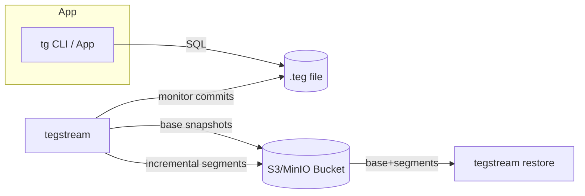
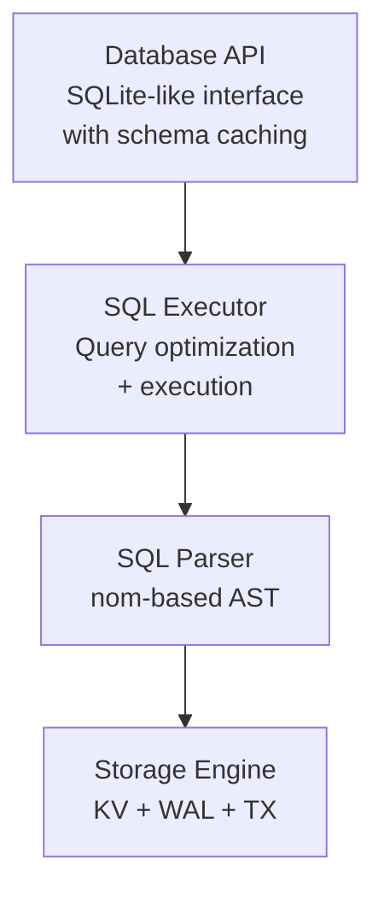

# TegDB

TegDB is a lightweight, embedded database engine with a SQL-like interface designed for simplicity, performance, and reliability. It provides ACID transactions, crash recovery, and efficient RDBMS.

> **Design Philosophy**: TegDB prioritizes simplicity and reliability over complexity. It uses a single-threaded design to eliminate concurrency bugs, reduce memory overhead, and provide predictable performance - making it ideal for embedded systems and applications where resource efficiency matters more than parallel processing.

## Key Features

### 🚀 **Performance**

- Zero-copy value sharing with Arc<[u8]>
- Primary key optimized queries (O(log n) lookups)
- Streaming query processing with early LIMIT termination
- Efficient binary serialization

### 🔒 **ACID Transactions**

- Atomicity: All-or-nothing transaction execution
- Consistency: Schema validation and constraint enforcement  
- Isolation: Write-through with snapshot-like behavior
- Durability: Write-ahead logging with commit markers

### 🛡️ **Reliability**

- Crash recovery from write-ahead log
- File locking prevents concurrent access corruption
- Graceful handling of partial writes and corruption
- Automatic rollback on transaction drop

### 📦 **Simple Design**

- Single-threaded architecture eliminates race conditions
- Minimal dependencies (only `fs2` for file locking)
- Clean separation of concerns across layers
- Extensive test coverage including ACID compliance

## Getting Started

### Quick Start (CLI + MinIO in 2–3 minutes)

This walkthrough uses released builds and the CLI tools, no code required.

1) Install the CLIs

```bash
# Clone the repository
git clone https://github.com/minifish-org/tegdb.git
cd tegdb

# Build tg CLI (no features needed)
cargo build --release --bin tg

# Build tegstream CLI (requires cloud-sync feature)
cargo build --release --features cloud-sync --bin tegstream

# Copy binaries to PATH (or add target/release to your PATH)
cp target/release/tg ~/.cargo/bin/
cp target/release/tegstream ~/.cargo/bin/

# Ensure ~/.cargo/bin is on your PATH
export PATH="$HOME/.cargo/bin:$PATH"
```

**Alternative**: If you prefer installing from crates.io (when features are available):

```bash
cargo install tegdb --version 0.3.0 --bin tg
cargo install tegdb --version 0.3.0 --features cloud-sync --bin tegstream
```

2) Start MinIO locally and create a bucket

```bash
# Run MinIO
docker run -d --name minio -p 9000:9000 -p 9001:9001 \
  -e MINIO_ROOT_USER=minioadmin -e MINIO_ROOT_PASSWORD=minioadmin \
  quay.io/minio/minio server /data --console-address :9001

# Create a bucket using the MinIO Console at http://localhost:9001 (Login: minioadmin/minioadmin)
# In the Console: Buckets → Create Bucket → Name: tegdb-backups
```

3) Configure AWS-compatible env vars for MinIO

```bash
export AWS_ACCESS_KEY_ID=minioadmin
export AWS_SECRET_ACCESS_KEY=minioadmin
export AWS_REGION=us-east-1
export AWS_ENDPOINT_URL=http://127.0.0.1:9000
export TEGSTREAM_BUCKET=tegdb-backups
```

4) Create and query a database with the `tg` CLI

```bash
# Use an absolute file URL ending with .teg
DB=file:///$(pwd)/quickstart.teg

# Create table and insert a row
tg "$DB" --command "CREATE TABLE users (id INTEGER PRIMARY KEY, name TEXT(32));"
tg "$DB" --command "INSERT INTO users (id, name) VALUES (1, 'Alice');"

# Query
tg "$DB" --command "SELECT * FROM users;"
```

5) Enable continuous cloud backup to MinIO with `tegstream`

```bash
# Create config file (use absolute path - replace /path/to with your actual path)
cat > tegstream.toml <<EOF
database_path = "$(pwd)/quickstart.teg"

[s3]
bucket = "tegdb-backups"
prefix = "dbs/quickstart"
region = "us-east-1"

[base]
interval_minutes = 15
segment_size_mb = 50

[segment]
min_bytes = 1024
debounce_ms = 1500

[retention]
bases = 3
max_segments_bytes = 107374182400

gzip = true
EOF

# Start replication (best run under a supervisor/tmux)
tegstream run --config tegstream.toml

# In another terminal, verify backup is working:
tegstream list --config tegstream.toml
# You should see base snapshots appearing every 15 minutes
```

## Using TegDB as a Library

Add TegDB to your `Cargo.toml`:

```toml
[dependencies]
tegdb = "0.3.0"
```

### Basic Usage

```rust
use tegdb::Database;

fn main() -> tegdb::Result<()> {
    // Open or create a database (must use absolute file:// path ending in .teg)
    let mut db = Database::open("file:///tmp/my_app.teg")?;
    
    // Create a table
    db.execute("CREATE TABLE users (id INTEGER PRIMARY KEY, name TEXT(32), age INTEGER)")?;
    
    // Insert data
    db.execute("INSERT INTO users (id, name, age) VALUES (1, 'Alice', 30)")?;
    db.execute("INSERT INTO users (id, name, age) VALUES (2, 'Bob', 25)")?;
    
    // Query data
    let result = db.query("SELECT name, age FROM users WHERE age > 25")?;
    
    println!("Found {} users:", result.len());
    for row in result.rows() {
        if let (Some(name), Some(age)) = (row.first(), row.get(1)) {
            println!("User: {:?}, Age: {:?}", name, age);
        }
    }
    
    Ok(())
}
```

### Transaction Example

```rust
use tegdb::Database;

fn main() -> tegdb::Result<()> {
    let mut db = Database::open("file:///tmp/bank.teg")?;
    
    // Create accounts table
    db.execute("CREATE TABLE accounts (id INTEGER PRIMARY KEY, name TEXT(32), balance INTEGER)")?;
    db.execute("INSERT INTO accounts (id, name, balance) VALUES (1, 'Alice', 1000)")?;
    db.execute("INSERT INTO accounts (id, name, balance) VALUES (2, 'Bob', 500)")?;
    
    // Transfer funds using explicit transaction
    let mut tx = db.begin_transaction()?;
    
    // Debit from Alice's account
    tx.execute("UPDATE accounts SET balance = balance - 100 WHERE id = 1")?;
    
    // Credit to Bob's account  
    tx.execute("UPDATE accounts SET balance = balance + 100 WHERE id = 2")?;
    
    // Commit the transaction (or it will auto-rollback on drop)
    tx.commit()?;
    
    println!("Transfer completed successfully!");
    Ok(())
}
```

## SQL Support

TegDB supports a comprehensive subset of SQL:

### Data Definition Language (DDL)

```sql
-- Create tables with constraints
CREATE TABLE products (
    id INTEGER PRIMARY KEY,
    name TEXT NOT NULL,
    price REAL,
    category TEXT
);

-- Drop tables
DROP TABLE IF EXISTS old_table;
```

### Data Manipulation Language (DML)

```sql
-- Insert single or multiple rows
INSERT INTO products (id, name, price) VALUES (1, 'Widget', 19.99);
INSERT INTO products (id, name, price) VALUES 
    (2, 'Gadget', 29.99),
    (3, 'Tool', 39.99);

-- Update with conditions
UPDATE products SET price = 24.99 WHERE name = 'Widget';

-- Delete with conditions
DELETE FROM products WHERE price < 20.00;

-- Query with filtering and limits
SELECT name, price FROM products 
WHERE category = 'Electronics' 
LIMIT 10;
```

### Transaction Control

```sql
BEGIN;
UPDATE accounts SET balance = balance - 100 WHERE id = 1;
UPDATE accounts SET balance = balance + 100 WHERE id = 2;
COMMIT;
-- or ROLLBACK;
```

### Supported Data Types

- `INTEGER` - 64-bit signed integers
- `REAL` - 64-bit floating point numbers  
- `TEXT` - UTF-8 strings (requires length specification, e.g., TEXT(100))
- `NULL` - Null values

## Performance Characteristics

### Time Complexity

- **Primary key lookups**: O(log n)
- **Range scans**: O(log n + k) where k = result size
- **Inserts/Updates/Deletes**: O(log n)
- **Schema operations**: O(1) with caching

### Memory Usage

- **In-memory index**: BTreeMap with Arc-shared values
- **Zero-copy reads**: Multiple references share same memory
- **Lazy allocation**: Undo logs only allocated when needed
- **Streaming queries**: LIMIT processed without loading full result

### Storage Format

- **Fixed header**: 64-byte header with magic `TEGDB\0`, version (1), limits, flags
- **Append-only log**: Fast writes after the header, no seek overhead
- **Binary serialization**: Compact data representation
- **Automatic compaction**: Reclaims space from old entries while preserving header
- **Crash recovery**: Replay from last commit marker

## Cloud Backup & Replication (tegstream)

TegDB includes `tegstream`, a standalone streaming backup tool that continuously replicates your database to cloud storage (S3, MinIO, etc.), similar to Litestream for SQLite.

### Features

- **Incremental Replication**: Tracks file offsets and uploads only committed changes
- **Base Snapshots**: Periodic full database snapshots for fast recovery
- **Automatic Rotation Detection**: Handles database compaction/rotation automatically
- **Point-in-Time Recovery**: Restore to any previous state using base + segments
- **Retention Policies**: Configurable retention for snapshots and segments
- **Compression**: Optional gzip compression to reduce storage costs

### Installation

Install from crates.io with the `cloud-sync` feature:

```bash
cargo install tegdb --version 0.3.0 --features cloud-sync --bin tegstream
```

### Configuration

Create a configuration file `tegstream.toml`:

```toml
database_path = "/absolute/path/to/your/database.teg"

[s3]
bucket = "my-backup-bucket"
prefix = "dbs/mydb"
region = "us-east-1"

[base]
interval_minutes = 60  # Create new base snapshot every hour
segment_size_mb = 100   # Or after 100MB of segments

[segment]
min_bytes = 1024        # Minimum segment size to upload
debounce_ms = 2000      # Wait 2 seconds before uploading

[retention]
bases = 3               # Keep last 3 base snapshots
max_segments_bytes = 107374182400  # 100GB max segments

gzip = true             # Enable compression
```

Tegstream requires AWS credentials (via environment variables, IAM roles, or `~/.aws/credentials`):

```bash
export AWS_ACCESS_KEY_ID=your-key
export AWS_SECRET_ACCESS_KEY=your-secret
export AWS_REGION=us-east-1
export AWS_ENDPOINT_URL=http://localhost:9000  # For MinIO
```

### Commands

```bash
# Run continuous replication
tegstream run --config tegstream.toml

# Create a one-off snapshot
tegstream snapshot --config tegstream.toml

# Restore database from backup
tegstream restore --config tegstream.toml --to /path/to/restored.teg

# List available snapshots
tegstream list --config tegstream.toml

# Prune old snapshots
tegstream prune --config tegstream.toml
```

### How It Works

1. **Monitoring**: Tegstream monitors your `.teg` file for new committed transactions
2. **Segment Uploads**: After each commit, new data is uploaded as incremental segments
3. **Base Snapshots**: Periodically (every N minutes or after N MB of segments), a full snapshot is created
4. **State Tracking**: Local state file tracks progress, file metadata, and prevents duplicate uploads
5. **Restore**: Downloads base snapshot + all subsequent segments to reconstruct the database

The tool is designed to be run as a background service alongside your application, providing continuous off-site backup with minimal overhead.



## Architecture Overview

TegDB implements a clean layered architecture with four distinct layers:



### Core Components

- **Storage Engine**: BTreeMap-based in-memory storage with append-only log persistence
- **Transaction System**: Write-through transactions with undo logging and commit markers
- **SQL Support**: Full SQL parser and executor supporting DDL and DML operations
- **Index-Organized Tables**: Primary key optimization with direct key lookups
- **Schema Caching**: Database-level schema caching for improved performance
- **Crash Recovery**: WAL-based recovery using transaction commit markers

See [ARCHITECTURE.md](ARCHITECTURE.md) for detailed information about:

- Layer-by-layer implementation details
- Storage format and recovery mechanisms  
- Memory management and performance optimizations
- Transaction system and ACID guarantees
- Query optimization and execution strategies

## Advanced Usage

### Engine Configuration

```rust
use tegdb::EngineConfig;

let config = EngineConfig {
    max_key_size: 1024,        // 1KB max key size
    max_value_size: 256 * 1024, // 256KB max value size  
    auto_compact: true,         // Auto-compact on open
};

// Note: Custom config requires dev feature and low-level API
```

### Low-Level Engine API

For advanced use cases, enable the `dev` feature to access low-level APIs:

```toml
[dependencies]
tegdb = { version = "0.3.0", features = ["dev"] }
```

```rust
use tegdb::{StorageEngine, EngineConfig};

// Direct key-value operations (requires absolute PathBuf)
let mut engine = StorageEngine::new(std::path::PathBuf::from("/tmp/data.teg"))?;
engine.set(b"key", b"value".to_vec())?;
let value = engine.get(b"key");

// Transaction control
let mut tx = engine.begin_transaction();
tx.set(b"key1", b"value1".to_vec())?;
tx.set(b"key2", b"value2".to_vec())?;
tx.commit()?;
```

## Development

### Building from Source

```bash
# Standard build
cargo build

# With development features
cargo build --features dev

# Run tests
cargo test --features dev

# Run benchmarks  
cargo bench --features dev
```

### Testing

TegDB includes comprehensive tests covering:

- ACID transaction properties
- Crash recovery scenarios  
- SQL parsing and execution
- Performance benchmarks
- Edge cases and error conditions

```bash
# Run the full native test suite
./run_all_tests.sh

# Run with verbose output
./run_all_tests.sh --verbose

# CI-friendly run (preserves test output)
./run_all_tests.sh --ci
```

### Code Quality

Use the following commands to keep the tree clean:

```bash
# Format source code
cargo fmt --all

# Run Clippy with the same settings as CI
cargo clippy --all-targets --all-features -- -D warnings

# Run the full CI-equivalent precheck suite
./ci_precheck.sh
```

### Benchmarks

Run performance benchmarks against other embedded databases:

```bash
cargo bench --features dev
```

Included benchmarks compare against:

- SQLite
- sled  
- redb

## Design Principles

1. **Simplicity First**: Prefer simple, understandable solutions
2. **Reliability**: Prioritize correctness over performance optimizations
3. **Standard Library**: Use std library when possible to minimize dependencies
4. **Single Threaded**: Eliminate concurrency complexity and bugs
5. **Resource Efficient**: Optimize for memory and CPU usage

## Limitations

### Current Limitations

- **Single-threaded**: No concurrent access support
- **No secondary indexes**: Only primary key optimization
- **Limited SQL**: Subset of full SQL standard
- **No foreign keys**: Basic constraint support only
- **No joins**: Single table queries only

### Future Enhancements

- Secondary index support
- JOIN operation support  
- More SQL features (subqueries, aggregation)
- Compression for large values
- Streaming for very large result sets
- Enhanced backup features (multi-DB support, encryption-at-rest)

## License

Licensed under AGPL-3.0. See [LICENSE](LICENSE) for details.

The AGPL-3.0 ensures that any modifications to TegDB remain open source and available to the community.

## Contributing

Contributions welcome! Please:

1. Follow the design principles above
2. Include comprehensive tests
3. Update documentation for new features
4. Ensure benchmarks still pass

See [CONTRIBUTING.md](CONTRIBUTING.md) for detailed guidelines.
