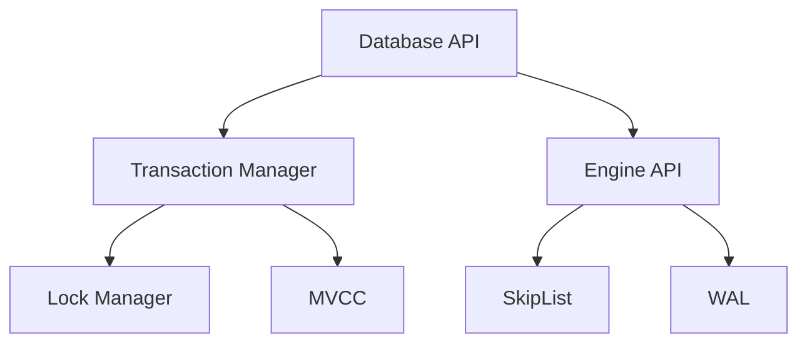

# TegDB Architecture

## Overview

TegDB is designed with a two-layer architecture that separates high-level transactional operations from low-level storage management. This design provides a clean separation of concerns while maintaining high performance and reliability.

## System Architecture

### Two-Layer Design

1. **Database Layer (High-Level)**
   - Transaction management
   - Snapshot isolation
   - Lock management
   - MVCC implementation

2. **Engine Layer (Low-Level)**
   - Key-value storage
   - Write-ahead logging
   - SkipList implementation
   - Garbage collection

### Component Interaction

## Core Components

### Transaction Manager

The Transaction Manager handles:

- Transaction lifecycle
- Snapshot management
- Conflict detection
- Rollback operations

### Lock Manager

The Lock Manager provides:

- Lock acquisition
- Deadlock detection
- Lock timeout handling
- Lock release

### MVCC

Multi-Version Concurrency Control:

- Snapshot creation
- Version management
- Garbage collection
- Conflict resolution

### WAL

Write-Ahead Logging:

- Transaction logging
- Crash recovery
- Durability guarantees
- Log compaction

### SkipList

In-memory storage:

- Concurrent access
- Ordered key-value pairs
- Efficient lookups
- Memory management

## Data Flow

### Write Operations

1. Transaction starts
2. Acquire locks
3. Write to WAL
4. Update SkipList
5. Commit transaction

### Read Operations

1. Create snapshot
2. Read from SkipList
3. Check MVCC
4. Return results

### Recovery Process

1. Read WAL
2. Rebuild SkipList
3. Roll back uncommitted
4. Resume operations

## Concurrency Control

### Transaction Isolation

- Serializable isolation
- Snapshot-based reads
- Write-write conflicts
- Read-write conflicts

### Lock Management

- Granular locking
- Deadlock prevention
- Timeout handling
- Lock escalation

## Memory Management

### SkipList Management

- Node allocation
- Memory limits
- Garbage collection
- Cache management

### Transaction State

- Snapshot storage
- Operation buffering
- Lock tracking
- Resource cleanup

## Disk Management

### WAL Management

- Log rotation
- Buffer management
- Disk synchronization
- Space management

### File Organization

- Data files
- Log files
- Temporary files
- Backup files

## Performance Considerations

### Memory Usage

- SkipList overhead
- Transaction state
- Lock tables
- Cache size

### Disk Usage

- WAL size
- Data files
- Temporary files
- Backup storage

### Concurrency Issues

- Lock contention
- Transaction conflicts
- Resource exhaustion
- Deadlocks

## Recovery Mechanisms

### Crash Recovery

1. Read WAL
2. Rebuild state
3. Roll back incomplete
4. Resume operations

### Transaction Recovery

1. Identify incomplete
2. Roll back changes
3. Release resources
4. Clean up state

## Future Improvements

### Architecture

- Distributed support
- Replication
- Sharding
- Backup/restore

### Performance

- Better concurrency
- Improved recovery
- Enhanced monitoring
- Optimized storage

### Reliability

- Better error handling
- Improved recovery
- Enhanced monitoring
- Better testing

### Maintainability

- Better documentation
- Cleaner code
- More tests
- Better tools
